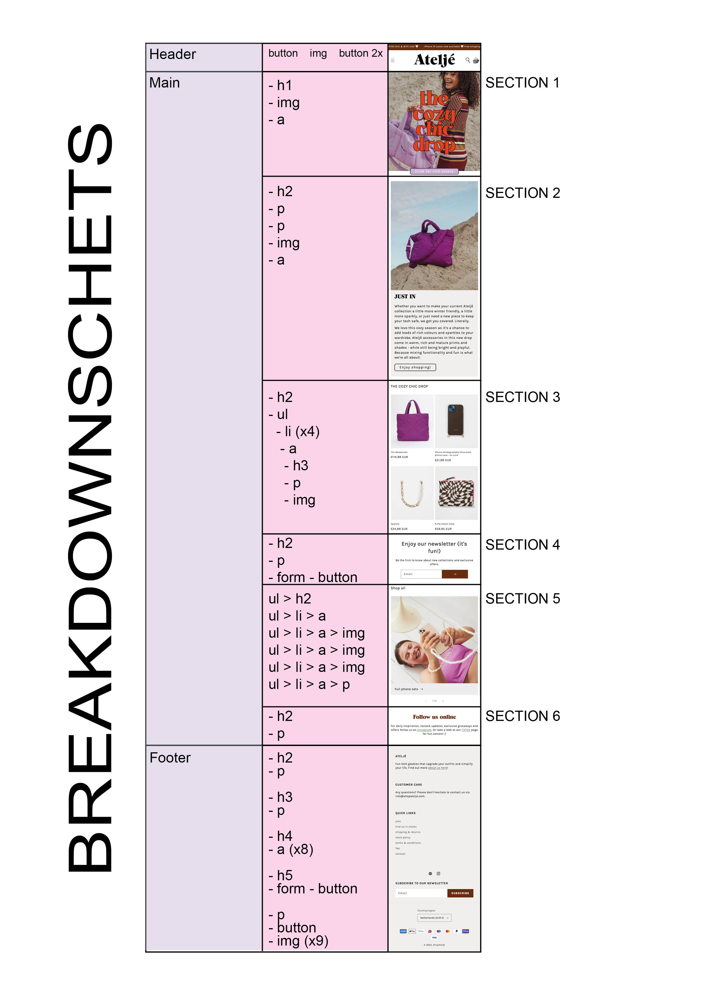
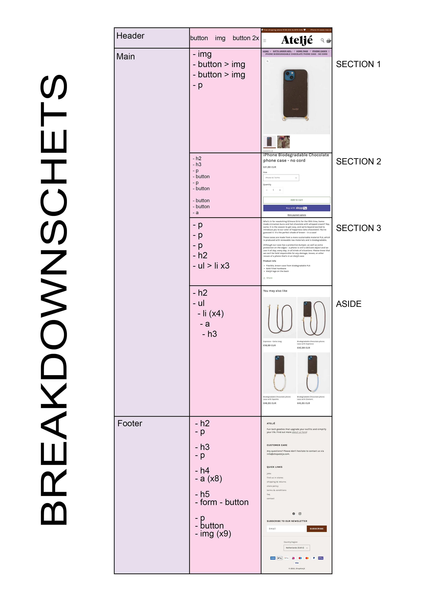
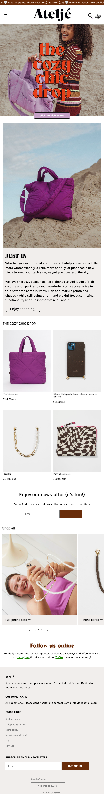
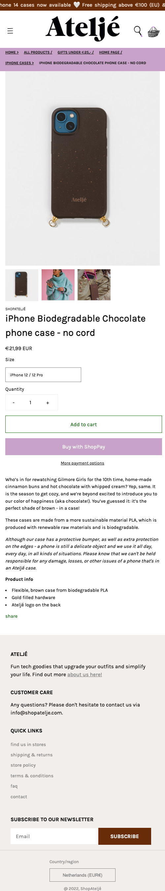

# Procesverslag
Markdown is een simpele manier om HTML te schrijven.  
Markdown cheat cheet: [Hulp bij het schrijven van Markdown](https://github.com/adam-p/markdown-here/wiki/Markdown-Cheatsheet).

Nb. De standaardstructuur en de spartaanse opmaak van de README.md zijn helemaal prima. Het gaat om de inhoud van je procesverslag. Besteedt de tijd voor pracht en praal aan je website.

Nb. Door *open* toe te voegen aan een *details* element kun je deze standaard open zetten. Fijn om dat steeds voor de relevante stuk(ken) te doen.

## Jij

  
uitwerken voor kick-off werkgroep

  ### Auteur:
  Hilal Tapan

  #### Je startniveau:
  Blauw

  #### Je focus:
  Resonsive
 

## Je website

  
uitwerken voor kick-off werkgroep

  ### Je opdracht:
  Shopatelje.com

  #### Screenshot(s) van de eerste pagina (small screen): 
  hier de naam van de pagina  
  

  #### Screenshot(s) van de tweede pagina (small screen):
  hier de naam van de pagina  
  
 

## Toegankelijkheidstest 1/2 (week 1)

  
uitwerken na test in 1e werkgroep

  ### Bevindingen
  Lijst met je bevindingen die in de test naar voren kwamen:

  #### Screenreader
  De screenreader was een beetje apart bij de producten. Hij herhaalt het product heel vaak wat niet heel gebruiksvriendelijk is. Dit zou zeker beter kunnen.

  #### Muis en Toetsenbord 
  Alles werkte, ik vind het leuk dat ze een hoverstate hebben bij de tab.

  #### Motoriek (shocks, elastiekjes)
  Ik vond het moeilijk om de site door te gaan met een verminderde motoriek. Maar daar kan een site niet heel veel aan doen. Ik vond het fijn dat ik met tab overal doorheen kon want scrollen ging heel moeizaam.

  #### Visueel (brillen, contrast, kleurenblind, dark/light). 
  De site is goed te zien door de felle heldere kleuren en grote teksten. Er is geen dark/light mode beschikbaar. Het contrast is prima, je hebt een lichte achtergrond en felle kleuren daarbovenop. De kleurenblind extensie werkte ook goed, niks op aan te merken.

## Breakdownschets (week 1)

  
uitwerken na afloop 2e werkgroep

  ### de hele pagina: 
  

  

## Voortgang 1 (week 2)

  
uitwerken voor 1e voortgang

  ### Stand van zaken
  Het gaat tot nu toe erg goed. Ik vind het fijn dat ik tot nu toe alle lessen heb kunnen volgen, vind dit altijd erg leerzaam. Ben bezig geweest met mijn breakdown schets en dit ging eigenlijk prima.

  ### Agenda voor meeting
  samen met je groepje opstellen

  - menno: vraag over grid
  - Laiba: vraag over hoeveel css bestanden en vraag over font
  - hilal: vraag over breakdownschets en hamburger menu spannetjes
  - wessel: vraag over wanneer je grid gebruikt en wanneer flexbox

  ### Verslag van meeting
  hier na afloop snel de uitkomsten van de meeting vastleggen

  - Je breakdown schets klopt. In de hoofdpagina is dat stukje geen aside maar een section, dus had het goed gedaan.
  - Die drie zinnen bovenaan bij de css heb ik uitleg over gehad, deze snapte ik niet wat ze deden. Nu wel en heb het in comments erbij gezet in de css.
  - Hamburger menu in een nav zetten (met spannetjes?)
  - Elke section moet een h2 hebben
  - Alsje hoofdletters wil moetje in css text-transform:uppercase;

## Voortgang 2 (week 3)

  
uitwerken voor 2e voortgang

  ### Stand van zaken
  Ik vind dat het goed gaat! Ik heb een grote sprong in de css gemaakt en dat komt omdat ik er veel plezier in heb en vind daardoor het huiswerk zelfs leuk. Ik ben deze week aan de slag geweest met grid, ik wou graag met grid werken omdat ik dit nog nooit had gedaan. Hierin wil ik mezelf uitdagen en merk dat ik grid nu al zoveel beter snap. Het ging 1 keer fout deze week maar dat kwam omdat ik de code op de verkeerde selector had gezet verder klopte het gewoon :)

  ### Agenda voor meeting
  samen met je groepje opstellen

  Hilal:
  Vraag 1: Doe ik de fontface goed op deze manier? 
  Vraag 2: Vind een carousel starten lastig, vooral als je bij het swipen de nummers ziet veranderen zoals op mijn site. Hoe kan ik dit het beste aanpakken en heb ik hier javascript voor nodig?
  Vraag 3: Een stukje van me hamburger menu gaat mee bij het scrollen, waardoor komt dit?
  Vraag 4: Waarom als ik me hamburger responsive maak gaan die list items niet mee?

  Laiba:
  vraag 1 (formulieren): Formulieren, hoe moet je erin verwerken? Mag ik het verstoppen? (Surface plane)
  vraag 2 (img): 3 images kan ik nergens vinden (inspect network)
  Vraag 3 (hamburger menu):ik zie naast de hamburger menu icon mijn andere icons niet

  Menno: Vraag 1: ik heb een vraag over het semantisch maken van mijn HTML, mijn CSS luistert niet en ik weet niet hoe het komt.

  Wessel:
  Vraag 1: Hamburger menu openen lukt, maar weer sluiten lukt niet. Hoe komt dit?
  Vraag 2: Display flex items plaatsen hoe ik wil zonder, losse items van space between.
  Vraag 3: Hoe ontwerp je het kruisje dat input form leegt?
  

  ### Verslag van meeting
  hier na afloop snel de uitkomsten van de meeting vastleggen

  - Fontface doe je 3 verschillende aanmaken ipv alles op eentje.
  - Die carousel maak je met javascript
  - Height 100% width 90%, overflow hidden niet vergeten bij je header -> gedaan maar probleem is niet opgelost..
  - Omdat je die items opnieuw moet aanmaken in die header en dan display none geven en dan met mediaqueries naar zichtbaar maken.

## Toegankelijkheidstest 2/2 (week 4)

  
uitwerken na test in 8e werkgroep

  ### Bevindingen
  Lijst met je bevindingen die in de test naar voren kwamen (geef ook aan wat er verbeterd is):

  #### Screenreader
  De screenreader lijkt het prima te doen. Het hamburger menu is openklapbaar met spatie en dan leest die de navigatie op. Het enige wat de screenreader niet pakt is de carousel. Die slaat die geheel over.

  #### Muis en Toetsenbord 
  Muis en toetsenbord is zichtbaar, alleen heb ik geen rekening gehouden met de styling van dit. Dus dit wil ik nog aanpassen. Het moet een witte border zijn. 

  #### Motoriek (shocks, elastiekjes)
  Dit gaat helemaal goed. Ik heb hier eigenlijk niks aan toe te voegen.

  #### Visueel (brillen, contrast, kleurenblind, dark/light). 
  Het enige wat apart was was de kleurenblindheids test. Deze leek het niet te doen op alleen mijn gebouwde site, verder wel op alle andere sites. Na lang knoeien kwamen we erachter dat het lag aan mijn chrome die niet geupdate was. Want toen Menno me site opende via github toen deed die het wel bij hem en niet bij mij. 

## Voortgang 3 (week 4)

  
uitwerken voor 3e voortgang

  ### Stand van zaken
  In de vakantie vond ik het een beetje lastig om met school aan de slag te gaan. Toch heb ik wat dingetjes gedaan. Ik heb de carousel gemaakt waar ik zo tegen op keek en het was veel makkelijker dan verwacht. Omdat dit zo vlot ging heb ik de rest van pagina 1 afgemaakt. Het moet nog wel responsive gemaakt worden.

  ### Agenda voor meeting
  samen met je groepje opstellen

  Hilal:
  1. Me img moeten groeien bij responsive, vind het lastig dit te combineren met grid.
  2. Responsive maken van de nav lukt me niet. heb gedaan wat jeffrey vorige x zei maar werkt niet.
  3. Me padding doet apart bij section 2. Het word grijs ipv wit. Ook vind ik section 2 lasting met responsiveness.
  4. Hoe doe ik die kleine icoontjes uit de footer op me site. Zij hebben een soort code gebruikt hiervoor en geen img.
  5. Bij responsive van die kleine afbeeldingen heb ik vw gebruikt om die img's te laten groeien maar hierdoor verdwijnt die text eronder. als ik dan de gap aanpas zorgt dit voor overlapping met de groep eronder. Ook groeit het heel lelijk dan.

  
  Laiba:

  Menno: 

  Wessel:

  ### Verslag van meeting
  Ik had me grid een beetje verkeerd gedaan oeps. Ik had overal de rows gedefinieerd en dit hoefde helemaal niet. Ik ben er nu achter dat het veel makkelijker is zonder. Dus heb veel geleerd vandaag bij de tussenmeting. Me nav is eindelijk ook responsive en was een makkelijkere manier voor. Ik ben blij want vrijwel al me vragen zijn beantwoord :)

## Eindgesprek (week 5)

  
uitwerken voor eindgesprek

  ### Je uitkomst - karakteristiek screenshots:
  
  

  ### Dit ging goed/Heb ik geleerd: 
  Korte omschrijving met plaatjes

  

  ### Dit was lastig/Is niet gelukt:
  Korte omschrijving met plaatjes

  

## Bronnenlijst

  
continu bijhouden terwijl je werkt

  Nb. Wees specifiek ('css-tricks' als bron is bijv. niet specifiek genoeg).

  1. bron 1
  2. bron 2
  3. ...

